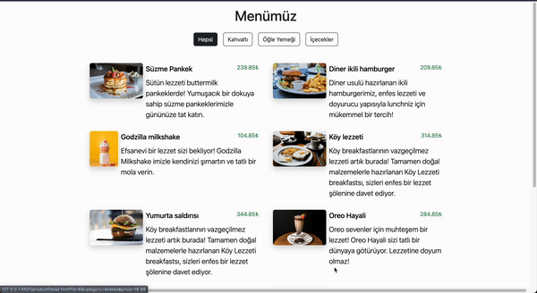

# QR Menu

**QR Menu** is a static web-based menu application with multiple pages, allowing users to browse and filter products and view individual product details. The project is designed with HTML, CSS, and JavaScript, focusing on easy navigation and user-friendly interactions.

## Features

- **Multi-page Navigation**: Includes four main pages, allowing users to seamlessly switch between different menu sections.
- **Product Pages**: Each product has a dedicated page with detailed information.
- **Filtering Options**: Users can filter products by categories to find specific items.
- **Responsive Design**: Crafted with CSS for an accessible and responsive experience across devices.

## Technologies Used

- **HTML**: Provides the structure and content layout.
- **CSS**: Styles the application for a visually appealing and responsive design.
- **JavaScript**: Powers navigation between pages and enables filtering.
  

